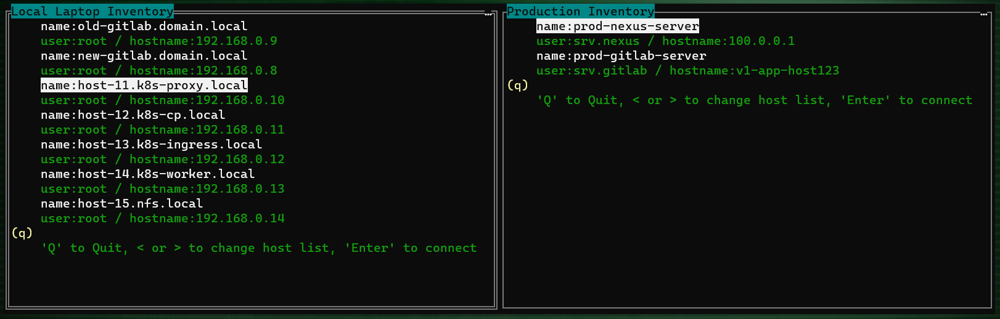

# ssm
simple ssh manager

inventory:
- 2 inventory files for each (left-right) panels
- inventory should be in ~.inventory1.json and inventory2.json
- or define in ENV SSHMANAGER_INVENTORY1=pathtoinventory1.json and ENV SSHMANAGER_INVENTORY2=pathtoinventory2.json  

TODO:
- jumphost functional
- add kubectl exec as jumphost functional
- exclude "legend" information to bottom panel
- use tmux inside of app window instead of current behavior (close app->exec ssh in default terminal)
- use 1 inventory with two lists intead of separate inventory files
